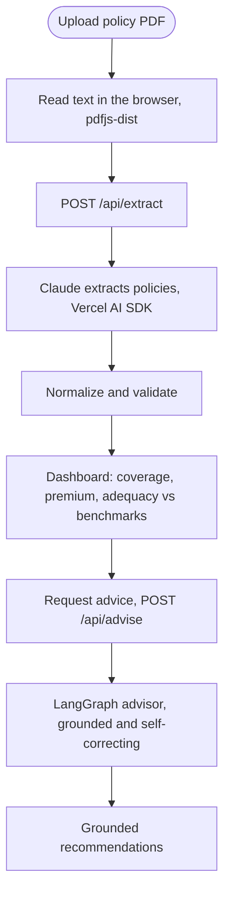
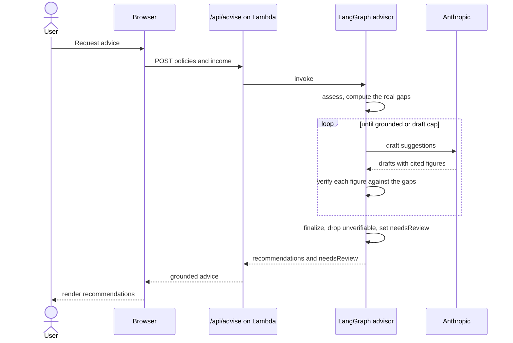
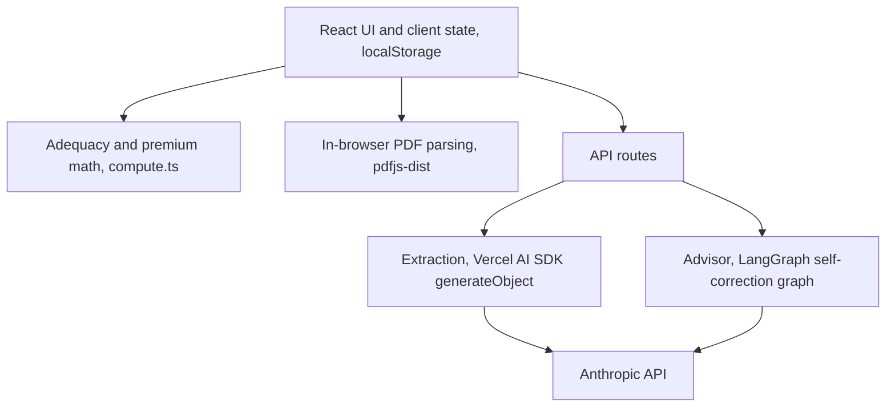
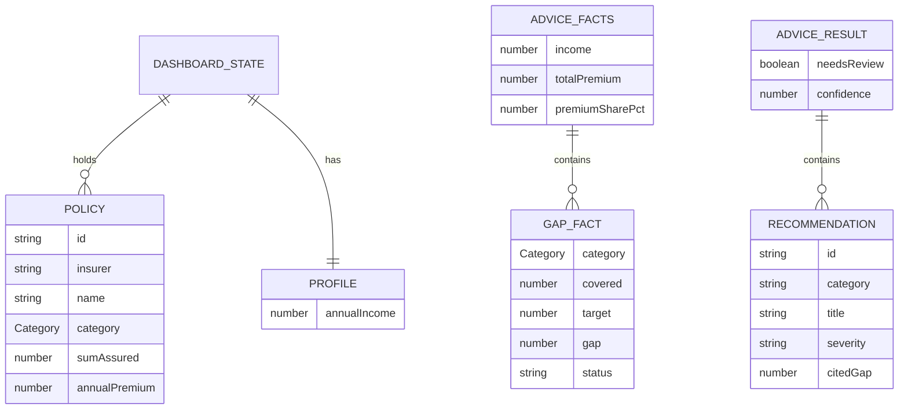
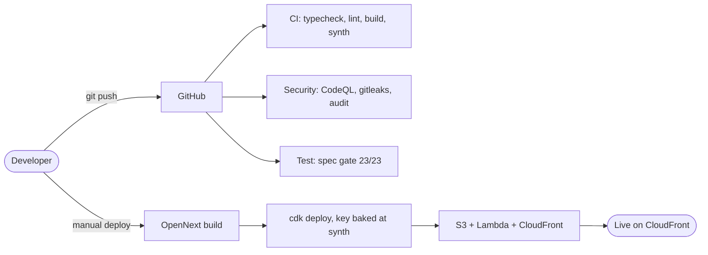

# CoverLens SG

Upload your Singapore insurance policy PDFs and get an instant coverage summary: what you are covered for by category, what you pay, and where your protection may fall short of the common rules of thumb. No data entry, the figures are read from your documents for you, and an AI advisor suggests grounded next steps.

**Live:** https://d33z7oya883ugt.cloudfront.net

> Estimates only, not financial advice. Benchmarks are rules of thumb from the LIA and MoneySense Basic Financial Planning Guide. Always confirm against your actual policy documents or a licensed adviser.

## What it does

- **Upload, do not type.** Drop one or more policy PDFs. The browser reads the text, an AI model extracts each policy (insurer, category, sum assured, premium), and the dashboard fills in automatically. One document can contain several policies.
- **Coverage by category.** Hospitalisation (Integrated Shield), life (death and TPD), critical illness, disability income, and personal accident, with a donut breakdown and per-category totals.
- **Adequacy check.** Add your annual income to compare cover against the benchmarks: death and TPD versus about 9x income, critical illness versus about 4x, shown as gauges with the gap or met status.
- **Premium view.** Total annual premium and its share of income against the roughly 15 percent protection guideline.
- **Grounded AI advisor.** Ask for personalised next steps. A LangGraph agent drafts suggestions, checks every dollar figure it cites against the gaps actually computed from your numbers, revises anything it cannot ground, and flags anything it had to set aside. It will not show you an invented figure.
- **Fix anything inline.** The policy list is editable, so anything the model misreads is corrected in place. A manual "add by hand" fallback covers documents that will not parse.

## How it works

From a dropped PDF to grounded advice, in one flow.



### The advisor request, step by step

The advisor is a LangGraph state graph whose headline is a self-correction loop: it never ships a figure it cannot match against your computed gaps.



### Privacy

The document text is sent to an AI service to extract the figures, and your policy summary is sent to generate advice. Neither is stored. This is a deliberate tradeoff for quality, and it is disclosed in the app. There is no database; everything else stays in your browser's `localStorage`. Do not upload anything you are not comfortable sharing with an AI service.

## Architecture

### Logical architecture

Responsibilities by layer. The browser owns parsing and state; the server owns the two AI-backed routes.



### Physical architecture

What runs in production. There is no database: the only persistent store is the user's browser.


### Data model

There is no server database. This is the client-side TypeScript domain model, held in React state and mirrored to `localStorage`. The advisor builds its own facts from these types at request time.



## Spec-driven development

Requirements are not prose, they are data. Every behaviour lives in `apps/insure/specs/insure.yml` as a uniquely identified `given / when / then` rule with a category and severity. Each ID is bound to a test by tagging the test title, and a strict coverage gate fails the build if any requirement is uncovered.

```yaml
- id: INSURE-ADVISOR-001
  title: Every recommendation is grounded in the computed coverage gaps
  category: data
  severity: critical
  given: Recommendations where one cites a dollar gap that does not match the computed figure
  when: The grounding check runs against the computed facts
  then: The recommendation citing the wrong figure is flagged while correctly cited ones pass
  tags: [advisor, grounding, safety]
```

The matching test is titled `[INSURE-ADVISOR-001] ...`. The coverage tool cross-checks the spec against the tests that actually ran:

```
insure v1: 100% covered (23/23)
```

Data requirements run on Vitest, the rest on Playwright, and accessibility is checked with axe. The non-deterministic AI calls are stubbed in e2e (`page.route` on `/api/extract` and `/api/advise`) so the gate stays offline and deterministic. The build is not done until the gate is green; tests and code ship in the same change.

## Tech stack

| Layer | Tech |
|---|---|
| Framework | Next.js 16 (App Router), React 19, TypeScript strict |
| Styling | Tailwind CSS v4, Geist fonts |
| PDF | `pdfjs-dist`, worker bundled as a `/_next/static` asset |
| AI extraction | Vercel AI SDK v6 with `@ai-sdk/anthropic`, `generateObject` and a Zod schema |
| AI advisor | LangGraph (`@langchain/langgraph`) state graph; model nodes reuse the same AI SDK |
| Validation | Zod at every server-route boundary |
| Infra | AWS Lambda, S3, CloudFront via OpenNext, provisioned with AWS CDK |
| Testing | Vitest, Playwright, axe; spec-driven coverage gate |
| Built on | the [platform template](https://github.com/elleskay/platform) |

## Local development

```bash
cd apps/insure
npm install
# The AI routes need a key; without it they return 503 and the app falls
# back to manual entry.
ANTHROPIC_API_KEY=sk-ant-... npm run dev
```

Open http://localhost:3000. Override the models with `EXTRACT_MODEL` (default `claude-haiku-4-5`) and `ADVISOR_MODEL` (default `claude-sonnet-4-6`).

## Testing

```bash
cd apps/insure
npm run test:spec   # build, unit, e2e, coverage gate
npm run lint
npx tsc --noEmit
```

## Deployment

Push runs the quality gates in GitHub Actions. The live deploy is a manual local CDK run, because the API key is baked into the Lambda environment at synth time and must be present when you deploy.



```bash
cd apps/insure && npm run build:open-next
cd ../../infra/cdk/insure
ANTHROPIC_API_KEY=sk-ant-... \
PLATFORM_DEMO_APP_PATH=apps/insure \
CDK_DEFAULT_REGION=ap-southeast-1 \
npx cdk deploy --require-approval never
```

Stack: `InsureServerless`. See `docs/DEPLOY.md` for the platform deploy gotchas.

### Before sharing the live URL publicly

`/api/extract` and `/api/advise` are public, unauthenticated endpoints with only input caps. Anyone calling them spends your API credits. Add rate limiting (the platform ships a no-op Upstash helper) or auth before wide exposure.

## Structure

```
apps/insure/
  app/            # layout, page, /api/extract, /api/advise, globals.css
  components/     # Dashboard, Advisor, PdfUpload, Aurora, TiltCard
  lib/insure/     # types, compute (adequacy/premium), extract-ai (schema + normalize),
                  # advisor (grounding logic), advisor-graph (LangGraph graph), meta
  specs/          # insure.yml (the source of truth for tests)
  tests/          # unit (Vitest) + e2e (Playwright) + fixtures
infra/cdk/insure/ # CDK package (stack InsureServerless)
```

## License

MIT.
