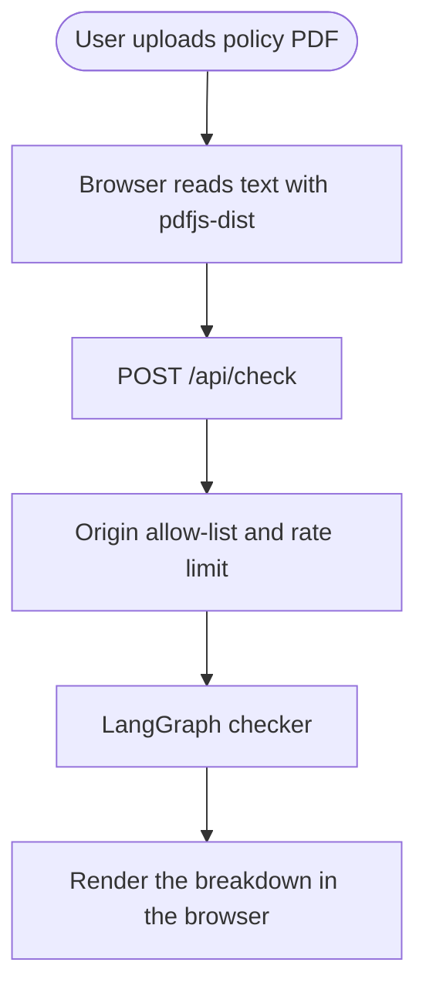
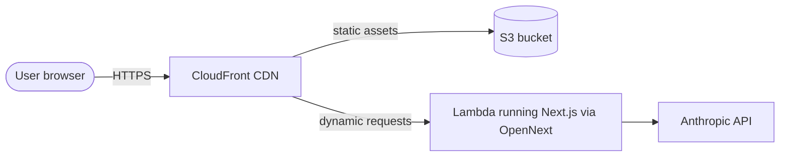
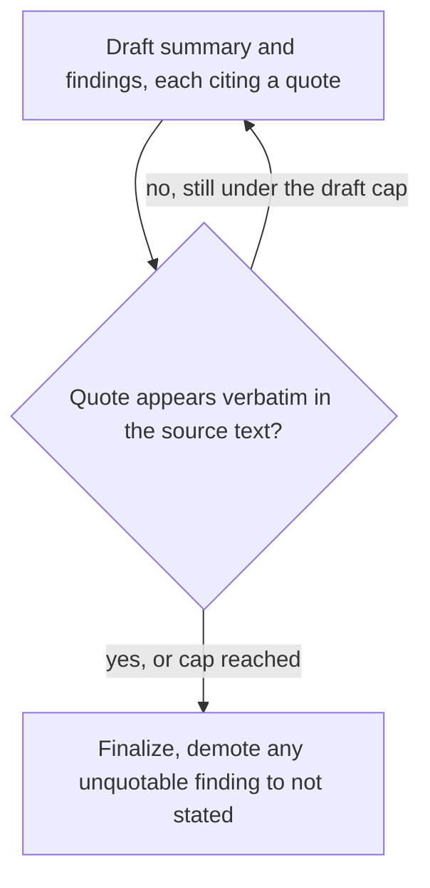

# CoverLens System Design

> A system design breakdown of CoverLens, an AI checker that reads a Singapore insurance policy PDF and surfaces, in plain language, what it covers and the fine print that decides a claim. Every finding is backed by a verbatim quote from the document.
>
> **Live demo** at https://coverlens.soonkeong.dev

---

## Understanding the Problem

CoverLens takes an insurance policy PDF and returns a plain-language reading of it, made up of an itemised coverage breakdown, the payout-deciding definitions, a curated fine-print checklist, and a worked will-this-pay-out example.

The defining constraint is trust. A checker that confidently invents an exclusion or a limit is worse than useless, because a user would act on a term that is not in their policy. So the central design problem is not "summarise a PDF with an LLM," it is "summarise a PDF such that the system can never show a claim it cannot prove is in the document." Everything else follows from that.

### Functional Requirements

- Users should be able to upload one or more policy PDFs and get each read into a plain-language summary.
- Users should be able to see, per policy, an itemised coverage breakdown, every benefit with its limit.
- Users should be able to see the payout-deciding definitions, such as the disability basis, critical-illness severity, survival period, and covered conditions.
- Users should be able to see a curated fine-print checklist, each item marked found or not stated, in a fixed order so nothing silently disappears.
- Users should be able to see a worked payout example when the document states a deductible and co-payment.
- Every finding should be traceable to a verbatim quote from the user's document.

Out of scope: user accounts, server-side storage of documents or history, and financial advice. This is a plain-language reading only.

### Non-Functional Requirements

- The system should be grounded, with 100 percent of shown findings backed by a verbatim quote and anything unquotable dropped. This is safety-critical and drives the core design.
- The system should protect privacy, storing documents nowhere, with the only persistence being the user's own browser.
- The system should return a check within a few seconds for a typical policy.
- The system should keep a public, unauthenticated, paid endpoint within a bounded number of model calls per minute per caller.
- The system should be deterministically testable despite a non-deterministic model in the loop.

---

## The Set Up

### Planning the Approach

CoverLens is heavy on reading text and light on writing data. The output is derived from the uploaded document and consumed immediately, so there is no durable record worth keeping. That shapes three choices. Push work to the browser where possible, which means parsing and all state live client-side. Keep one stateless server route for the single model-backed step. And treat grounding as the property the whole system exists to protect. The priority order, grounding first, then privacy, then cost, drives every later decision.

### Defining the Core Entities

There is no server database. This is the client-side domain model, built by the checker at request time and held in browser state.

- **PolicyCheck**, one checked policy, holding insurer, name, category, and summary.
- **CoverageItem**, one benefit, holding the benefit, its limit, a detail, and the quote it was drawn from.
- **DefinitionItem**, one payout-deciding term, holding the term, its definition, and the quote.
- **CheckItem**, one curated fine-print key, holding the key, a status of found or not-stated, a detail, a quote, and a severity.
- **Payout**, an optional worked example, holding the deductible, co-payment percent, and co-payment cap.

### API or System Interface

One model-backed endpoint, plus an in-browser parse step that keeps the raw file off the network as a binary. The browser reads the PDF to text with pdfjs-dist and posts only the extracted text.

`POST /api/check`

Request:

```json
{ "text": "the full text extracted from the PDF in the browser" }
```

Response:

```json
{
  "policies": [
    {
      "insurer": "Great Eastern",
      "name": "GREAT TermLife",
      "category": "life",
      "summary": "Plain-language summary of the policy.",
      "coverage":    [{ "benefit": "Death benefit", "limit": "SGD 500,000", "quote": "verbatim from the document" }],
      "definitions": [{ "term": "Total and Permanent Disability", "definition": "...", "quote": "verbatim from the document" }],
      "checklist":   [{ "key": "survivalPeriod", "status": "found", "severity": "caution", "quote": "..." },
                      { "key": "preExisting", "status": "not-stated" }],
      "payout": { "deductible": 3500, "coPayPercent": 10, "coPayCap": 3000 }
    }
  ]
}
```

The endpoint fails safe. A missing model key returns 503, and a caller that fails the origin allow-list or the rate limit is rejected before any model call runs.

---

## High-Level Design

We build the design one functional requirement at a time.

### 1) A user can upload a policy and have it read

The browser reads the dropped PDF to text with pdfjs-dist, so the raw file never crosses the network. It posts only the extracted text to the check endpoint on a Lambda, which passes an origin allow-list and a rate limit before any model work begins.



### 2) The system returns a structured breakdown of the policy

Inside the route, a LangGraph checker turns the policy text into the core entities. For each policy it produces a summary, an itemised coverage list with limits, the payout-deciding definitions, the fine-print checklist with each curated key marked found or not stated, and an optional worked payout example. The drafting is a model node, the Vercel AI SDK generateObject call with a Zod schema, so the output shape is enforced before it reaches the browser.

### 3) Every finding is traceable to a verbatim quote

Every finding the user sees carries the exact wording it came from. The drafter cites a verbatim quote for each coverage item, definition, and checklist entry, and the interface exposes a show-the-wording disclosure on each one. Whether that cited quote is trustworthy is the hard part, handled in the first deep dive.

### Physical deployment

There is no database. The only persistent store is the user's browser.



---

## Potential Deep Dives

### 1) How do we guarantee a finding is never shown unless it is quoted from the document?

A single model call cannot guarantee this, because models paraphrase and invent.

<details>
<summary><strong>Bad solution: trust one model call</strong></summary>

Prompt the model for the findings and render whatever comes back. One call, fast and simple. Nothing stops it from inventing an exclusion or a limit that is not in the policy, the exact failure that makes the product worse than useless.
</details>

<details>
<summary><strong>Good solution: ask the model to cite and self-check</strong></summary>

Require a verbatim quote on each finding, and ask the model in the same prompt to drop anything it cannot quote. This catches obvious inventions, but it still trusts the model to police itself, and a model that hallucinated a finding will happily hallucinate a matching quote, so the guarantee stays soft.
</details>

<details>
<summary><strong>Great solution: a deterministic verify loop</strong></summary>

Separate drafting from verifying. A model node drafts findings with cited quotes, then a deterministic, model-free node checks that each quote appears verbatim in the document text. Anything that fails is re-drafted up to a cap, then demoted to not stated rather than shown. The guarantee comes from code, not from trusting the model, which is also why it is unit-testable without a model. This is what CoverLens runs.


</details>

### 2) How do we handle sensitive documents without becoming a breach liability?

Insurance policies are sensitive financial documents, so where they rest matters.

<details>
<summary><strong>Bad solution: store the documents for history and analytics</strong></summary>

Persist every uploaded document in a database so users get history and you get analytics. Convenient, but now you hold a pile of sensitive financial documents, which is a breach target and a compliance burden.
</details>

<details>
<summary><strong>Good solution: store only extracted text, encrypted, short retention</strong></summary>

Keep just the extracted text, encrypted at rest, and delete it after a short window. A smaller surface, but you still own sensitive data and the retention window is still a risk to manage and explain.
</details>

<details>
<summary><strong>Great solution: store nothing server-side</strong></summary>

The text is sent to the model to be read, then discarded, and results live only in the browser's localStorage. There is no datastore to breach. The trade-off is no cross-device history and the model provider does see the text, which is disclosed in the app. A deliberate quality-over-features choice.
</details>

### 3) How do we protect a public, unauthenticated, paid endpoint?

The check endpoint is unauthenticated and every call spends money on model tokens.

<details>
<summary><strong>Bad solution: leave it open</strong></summary>

Ship with no guard. Any script can call it in a loop and run up the bill, and a cross-site page can use it freely.
</details>

<details>
<summary><strong>Good solution: origin allow-list and an in-memory rate limit</strong></summary>

Reject cross-site and origin-less callers with an allow-list, and add a best-effort sliding-window rate limit on the route. Stops casual abuse, and is what the app ships. The limit only sees one Lambda instance, so under concurrency it is not a hard cap.
</details>

<details>
<summary><strong>Great solution: a shared limiter and a per-user quota</strong></summary>

Move the counter to Upstash Redis so the limit holds across every instance at once, and add a per-user quota so one caller cannot drain the budget. The path before wide public exposure.
</details>

### 4) How do we keep model cost bounded as usage grows?

The model call is the real cost, so the question is how to avoid paying for it more than necessary.

<details>
<summary><strong>Bad solution: every request hits the model</strong></summary>

Run the full check on every upload with no caching. Cost grows linearly with traffic, and re-checking the same policy pays again every time.
</details>

<details>
<summary><strong>Good solution: cheaper model for short documents</strong></summary>

Route short documents to a cheaper model and cap request size. Trims the average cost, but identical uploads are still re-processed from scratch.
</details>

<details>
<summary><strong>Great solution: a content cache and a queue for large documents</strong></summary>

Cache results keyed on a document fingerprint so re-checking the same policy is free, queue very large documents so the request path stays fast, and log per-call latency and cost so spend is visible. Scale-to-zero Lambda already handles concurrency, so this is about cost, not servers.
</details>

### 5) How do we test a non-deterministic, model-backed system in CI?

The grounding rule must be proven on every build, but the model is non-deterministic.

<details>
<summary><strong>Bad solution: call the real model in tests</strong></summary>

Hit the live model in the test suite. Flaky, slow, costs money on every run, and a model update can silently turn the build red for no code reason.
</details>

<details>
<summary><strong>Good solution: record and replay fixtures</strong></summary>

Record real model responses once and replay them. Deterministic and offline, but the fixtures drift from reality over time and must be re-recorded to stay honest.
</details>

<details>
<summary><strong>Great solution: deterministic grounding plus a stubbed model</strong></summary>

The grounding logic is deterministic and model-free, so it is unit-tested directly on Vitest. The Playwright e2e stubs the model via page.route so it is offline. A spec maps each of the 28 requirements to a passing test, and the gate fails the build if any is uncovered. The one thing that must be correct, grounding, is tested without a model at all.
</details>

---

## Tech stack

| Layer | Tech |
|---|---|
| Framework | Next.js 16 (App Router), React 19, TypeScript strict |
| PDF | pdfjs-dist, worker bundled as a static asset |
| AI checker | LangGraph grounding graph, model node via Vercel AI SDK generateObject with the Anthropic provider |
| Grounding | Deterministic quote-in-document verification, unit-tested without a model |
| Validation | Zod at the route boundary |
| Abuse guards | Origin allow-list, best-effort in-memory rate limit |
| Infra | AWS Lambda, S3, CloudFront via OpenNext, provisioned with AWS CDK |
| Testing | Vitest, Playwright, axe, plus a spec-driven coverage gate |
| Built on | the [platform template](https://github.com/elleskay/platform) |

## License

MIT.
