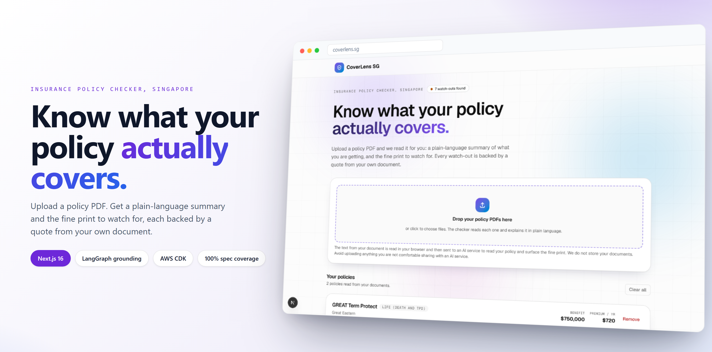
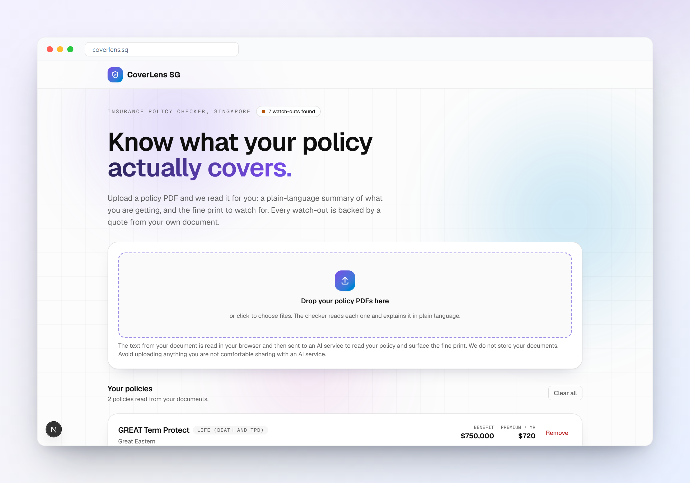
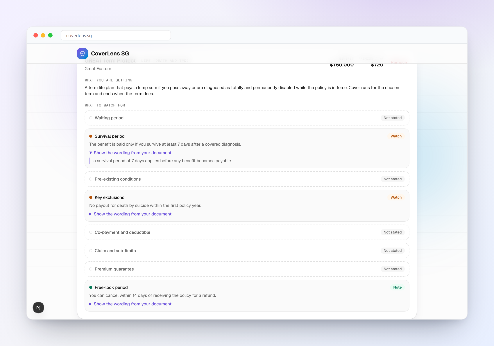
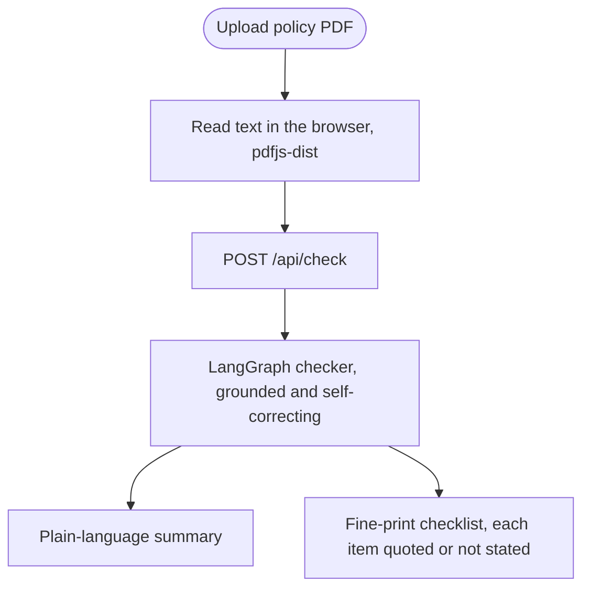
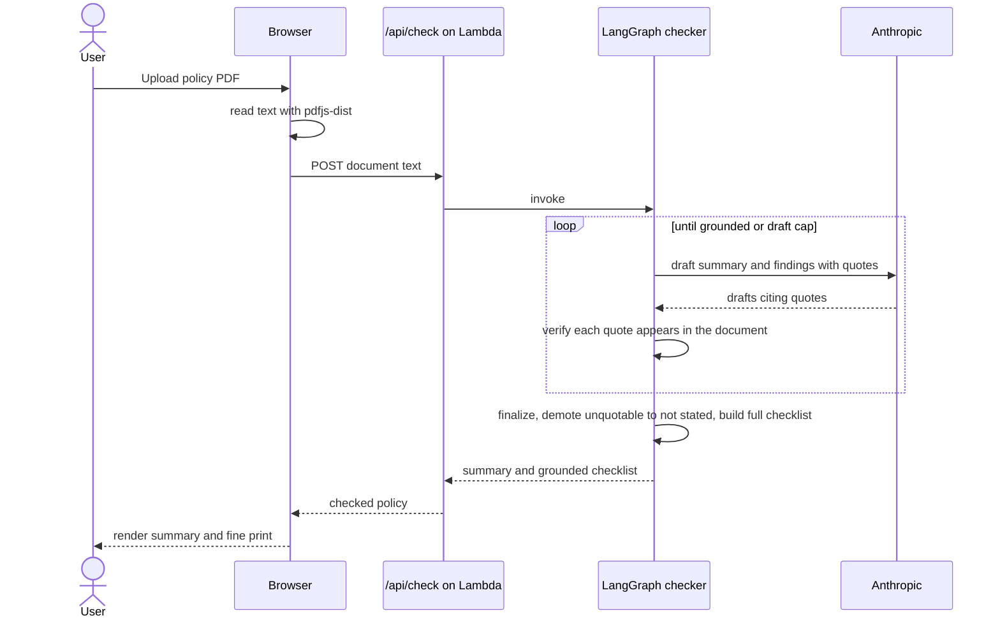
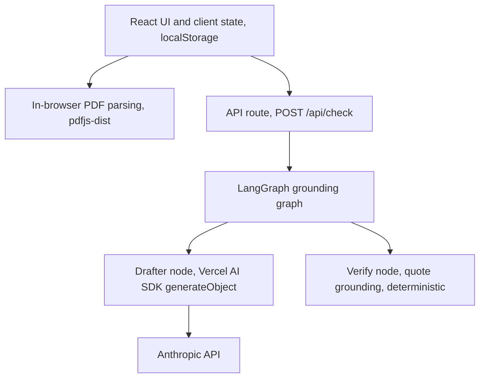
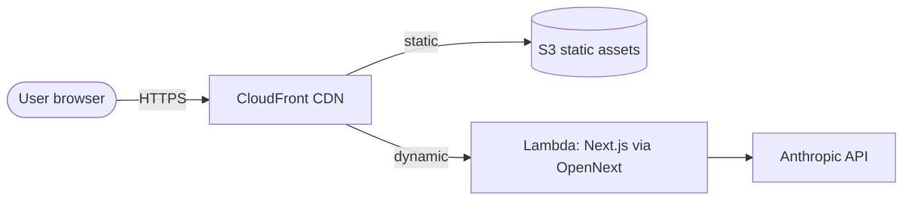
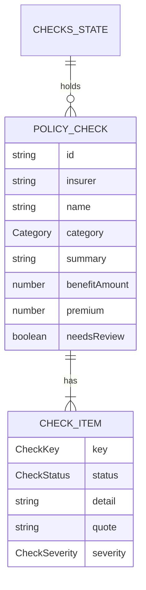

# CoverLens SG



Upload a Singapore insurance policy PDF and CoverLens reads it for you: a plain-language summary of what you are getting, plus a curated checklist of the fine print to watch for. Every watch-out it shows is backed by a verbatim quote from your own document, so nothing is taken on trust.

**Live:** https://d33z7oya883ugt.cloudfront.net

> A plain-language reading of your policy document, not financial advice. An AI reads the text and may miss or misread terms. Always confirm against your actual policy wording or a licensed financial adviser.

## What it does

- **Upload, do not type.** Drop one or more policy PDFs. The browser reads the text and sends it to an AI checker. One document can contain several policies.
- **Plain-language summary.** For each policy, a short "what you are getting" explanation: what it covers, what triggers a payout, and the headline benefit, written for someone with no insurance background.
- **A curated fine-print checklist.** The watch-outs that matter for Singapore policies: waiting period, survival period, pre-existing conditions, key exclusions, co-payment and deductible, claim and sub-limits, premium guarantee, and free-look period. Each item is marked found or not stated, so nothing silently disappears.
- **Grounded, never invented.** A LangGraph agent drafts the findings, then checks that every one is backed by a verbatim quote from your document. Anything it cannot quote is re-drafted, then demoted to "not stated" rather than shown. A hallucinated exclusion is dangerous, so the app refuses to surface one.
- **Trace any finding to the source.** Each found watch-out has a "show the wording from your document" disclosure with the exact quote it was drawn from.

## Screenshots

**Overview.** Upload a policy and it is read into a plain-language card, with a running count of the watch-outs found.



**What to watch for.** The curated checklist per policy. Found items carry a severity and the verbatim quote from your document; the rest are clearly marked not stated.



## How it works

From a dropped PDF to a grounded breakdown, in one flow.



### The check request, step by step

The checker is a LangGraph state graph whose headline is a self-correction loop: it never surfaces a finding it cannot quote from your document.



### Privacy

The document text is sent to an AI service to read it. It is not stored. This is a deliberate tradeoff for quality, and it is disclosed in the app. There is no database; everything else stays in your browser's `localStorage`. Do not upload anything you are not comfortable sharing with an AI service.

## Architecture

### Logical architecture

Responsibilities by layer. The browser owns parsing and state; the server owns the one AI-backed route, inside which the graph separates the model work from the deterministic grounding.



### Physical architecture

What runs in production. There is no database: the only persistent store is the user's browser.



### Data model

There is no server database. This is the client-side TypeScript domain model, held in React state and mirrored to `localStorage`. The checker builds and returns these types at request time.



The checklist always holds one `CHECK_ITEM` per curated key, in a fixed order, each either `found` (with `detail` and `quote`) or `not-stated`.

## Spec-driven development

Requirements are not prose, they are data. Every behaviour lives in `apps/insure/specs/insure.yml` as a uniquely identified `given / when / then` rule with a category and severity. Each ID is bound to a test by tagging the test title, and a strict coverage gate fails the build if any requirement is uncovered.

```yaml
- id: INSURE-CHECK-001
  title: A fine-print finding is grounded only if its quote appears in the document
  category: data
  severity: critical
  given: Draft findings where one cites a quote that is not present in the policy document text and one cites a quote that is
  when: The grounding check runs against the source text
  then: The finding whose quote is absent from the source is flagged as ungrounded while the finding whose quote is present passes
  tags: [checker, grounding, safety]
```

The matching test is titled `[INSURE-CHECK-001] ...`. The coverage tool cross-checks the spec against the tests that actually ran:

```
insure v1: 100% covered (16/16)
```

The grounding logic runs on Vitest, the rest on Playwright, and accessibility is checked with axe. The non-deterministic AI call is stubbed in e2e (`page.route` on `/api/check`) so the gate stays offline and deterministic. The build is not done until the gate is green; tests and code ship in the same change.

## Tech stack

| Layer | Tech |
|---|---|
| Framework | Next.js 16 (App Router), React 19, TypeScript strict |
| Styling | Tailwind CSS v4, Geist fonts |
| PDF | `pdfjs-dist`, worker bundled as a `/_next/static` asset |
| AI checker | LangGraph (`@langchain/langgraph`) grounding graph; the model node reuses the Vercel AI SDK (`generateObject` + `@ai-sdk/anthropic` + a Zod schema) |
| Grounding | Deterministic quote-in-document verification, unit-tested without a model |
| Validation | Zod at the server-route boundary |
| Infra | AWS Lambda, S3, CloudFront via OpenNext, provisioned with AWS CDK |
| Testing | Vitest, Playwright, axe; spec-driven coverage gate |
| Built on | the [platform template](https://github.com/elleskay/platform) |

## Local development

```bash
cd apps/insure
npm install
# The checker route needs a key; without it, it returns 503.
ANTHROPIC_API_KEY=sk-ant-... npm run dev
```

Open http://localhost:3000. Override the model with `CHECKER_MODEL` (default `claude-sonnet-4-6`).

## Testing

```bash
cd apps/insure
npm run test:spec   # build, unit, e2e, coverage gate
npm run lint
npx tsc --noEmit
```

## Deployment

Push runs the quality gates in GitHub Actions. The live deploy is a manual local CDK run, because the API key is baked into the Lambda environment at synth time and must be present when you deploy.


```bash
cd apps/insure && npm run build:open-next
cd ../../infra/cdk/insure
ANTHROPIC_API_KEY=sk-ant-... \
PLATFORM_DEMO_APP_PATH=apps/insure \
CDK_DEFAULT_REGION=ap-southeast-1 \
npx cdk deploy --require-approval never
```

Stack: `InsureServerless`. See `docs/DEPLOY.md` for the platform deploy gotchas.

### Before sharing the live URL publicly

`/api/check` is a public, unauthenticated endpoint with only an input cap. Anyone calling it spends your API credits. Add rate limiting (the platform ships a no-op Upstash helper) or auth before wide exposure.

## Structure

```
apps/insure/
  app/            # layout, page, /api/check, globals.css
  components/     # PolicyChecker, PdfUpload, Aurora, TiltCard
  lib/insure/     # types (domain + checklist), checker (grounding logic + schema + prompt),
                  # checker-graph (LangGraph graph), meta
  specs/          # insure.yml (the source of truth for tests)
  tests/          # unit (Vitest) + e2e (Playwright) + fixtures
infra/cdk/insure/ # CDK package (stack InsureServerless)
```

## License

MIT.
